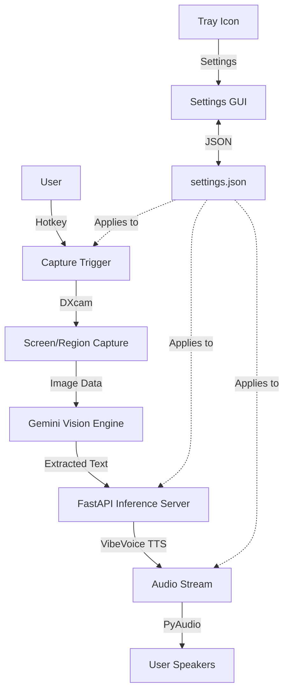

<!-- Based on https://github.com/othneildrew/Best-README-Template/ -->
<a id="readme-top"></a>

<!-- PROJECT SHIELDS & BUILT WITH ICONS -->
<!--
*** I'm using markdown "reference style" links for readability.
*** Reference links are enclosed in brackets [ ] instead of parentheses ( ).
*** See the bottom of this document for the declaration of the reference variables
*** for contributors-url, forks-url, etc. This is an optional, concise syntax you may use.
*** https://www.markdownguide.org/basic-syntax/#reference-style-links
-->
[![Forks][forks-shield]][forks-url]
[![Stargazers][stars-shield]][stars-url]
[![Issues][issues-shield]][issues-url]
[![MIT License][license-shield]][license-url]
  <!-- Built With Icons integrated here to save space -->
[![Python][Python]][Python-url]
[![FastAPI][FastAPI]][FastAPI-url]
[![PyTorch][PyTorch]][PyTorch-url]
[![UV][UV]][UV-url]
[![Google Gemini][Gemini]][Gemini-url]

> [!WARNING]
> This is an ongoing personal project currently in active development. Features are subject to change.


<!-- PROJECT LOGO -->
<br />
<div align="center">
  <a href="https://github.com/alfred1137/ScreenBanter">
    
  </a>

  <h3 align="center">ScreenBanter</h3>

  <p align="center">
    Make your screen talk back. Real-time AI desktop narration.
    <br />
    <br />
    <a href="https://github.com/alfred1137/ScreenBanter/issues/new?labels=bug&template=bug-report---.md">Report Bug</a>
    &middot;
    <a href="https://github.com/alfred1137/ScreenBanter/issues/new?labels=enhancement&template=feature-request---.md">Request Feature</a>
  </p>
</div>

<!-- TABLE OF CONTENTS -->
<details>
  <summary>Table of Contents</summary>
  <ol>
    <li><a href="#overview">📖 Overview</a></li>
    <li><a href="#features">✨ Features</a></li>
    <li><a href="#technologies">📦 Technologies</a></li>
    <li>
      <a href="#installation-setup">🚀 Installation & Setup</a>
      <ul>
        <li><a href="#requirements">✅ Requirements</a></li>
        <li><a href="#installation">Installation</a></li>
      </ul>
    </li>
    <li><a href="#usage">🛠️ Usage</a></li>
    <li><a href="#configuration">🔧 Configuration</a></li>
    <li><a href="#repository-structure">🗂️ Repository Structure</a></li>
    <li><a href="#flow-chart">🔗 Flow Chart</a></li>
    <li><a href="#roadmap">Roadmap</a></li>
    <li><a href="#contributing">🤝 Contributing</a></li>
    <li><a href="#license">License</a></li>
    <li><a href="#contact">Contact</a></li>
    <li><a href="#acknowledgments">❤️ Acknowledgements</a></li>
    <li><a href="#changelog">📝 Changelog</a></li>
  </ol>
</details>

<!-- OVERVIEW -->
<a id="overview"></a>
## 📖 Overview

ScreenBanter is an amateur project that tries to marry **Google’s Gemini Vision** (for high-speed OCR via API) with **Microsoft’s VibeVoice-0.5B** (for local neural TTS) to provide desktop narration. It features capture-to-speech and an intelligent multi-screenshot queuing system.

<details>
<summary>Click to read the story behind the project idea...</summary>
<br />
    <p>
    The idea for this project emerged when I was playing a story-heavy turn-based RPG game called <strong>Battle Brothers</strong>. As a non-native speaker of English I occasionally struggle to maintain focus on the wall of text during game play (e.g. events, encounters, quests). I tried using the Windows build-in narrator but the result was underwhelming.    </p>
    <p>
    On a random day, I came across the <a href="https://github.com/microsoft/VibeVoice/blob/main/docs/vibevoice-realtime-0.5b.md"><strong>Microsoft’s VibeVoice-0.5B</strong></a> project. It has a colab demo that was so lightweight that you can run in a browser. Then birth this project.    </p>
</details>

<p align="right">(<a href="#readme-top">back to top</a>)</p>

<!-- FEATURES -->
<a id="features"></a>
## ✨ Features

*   **Instant Narration:** Capture and narrate the screen with a single hotkey (`Ctrl + Alt + S`).
*   **Batch Mode (Queueing):** Capture multiple windows or pages (`F10`) and process them as a single cohesive narrative (`F11`).
*   **Custom Region Capture:** Precisely define which part of the screen to narrate using an interactive transparent selector.
*   **Local Neural TTS:** Powered by VibeVoice for high-quality, low-latency audio without relying on cloud TTS credits.
*   **Settings GUI:** A modern `CustomTkinter` interface for managing hotkeys, voices, and audio devices.
*   **Smart Vision:** Uses Gemini Flash Lite (`models/gemini-flash-lite-latest`) via Gemini API for intelligent text extraction and context-aware merging of multiple screenshots.

<p align="right">(<a href="#readme-top">back to top</a>)</p>

<!-- INSTALLATION & SETUP -->
<a id="installation-setup"></a>
## 🚀 Installation & Setup

### ✅ Requirements

*   **OS:** Windows 10/11 (Required for `DXcam` and Win32 tray integration).
*   **GPU:** NVIDIA GPU with CUDA 12.1 support (Highly recommended for VibeVoice latency).
*   **Build Tools:** [Microsoft Visual C++ Build Tools](https://visualstudio.microsoft.com/visual-cpp-build-tools/) (Required for `pyaudio` and `pystray`).
*   **Package Manager:** [uv](https://github.com/astral-sh/uv) (Recommended).

### Installation

1.  **Clone the Repository**
    ```sh
    git clone https://github.com/alfred1137/ScreenBanter.git
    cd ScreenBanter
    ```

2.  **Setup Environment Variables**
    Create a `.env` file from the example:
    ```sh
    cp .env.example .env
    ```
    Edit `.env` and add your **GEMINI_KEY** from [Google AI Studio](https://aistudio.google.com/).

3.  **Install Dependencies**
    Using `uv`:
    ```sh
    uv sync
    ```
    *Note: The project pins `transformers` to 4.51.3 to maintain compatibility with VibeVoice.*

<p align="right">(<a href="#readme-top">back to top</a>)</p>

<!-- USAGE -->
<a id="usage"></a>
## 🛠️ Usage

**1. Launch the Application**
Starts the system tray app and the background TTS server.
```sh
uv run python -m app.main
```
*Wait for the announcement: "ScreenBanter is active."*

**2. Controls (Default Hotkeys)**

| Hotkey | Action | Description |
| :--- | :--- | :--- |
| **`Ctrl + Alt + S`** | **Instant Capture** | Narrates the current screen/region immediately. |
| **`F10`** | **Queue Screenshot** | Adds current view to buffer (confirmed by a beep). |
| **`F11`** | **Process Queue** | Merges all queued captures and narrating the result. |

<p align="right">(<a href="#readme-top">back to top</a>)</p>

<!-- CONFIGURATION -->
<a id="configuration"></a>
## 🔧 Configuration

Access settings by right-clicking the **Loudspeaker icon** in the system tray.

*   **Hotkeys:** Rebind any action to your preferred key combinations.
*   **Audio:** Select from multiple VibeVoice presets (e.g., `en-Davis_man`, `en-Emma_woman`). Adjust volume and playback speed.
*   **Capture Mode:** Toggle between `Fullscreen` and `Region`. In Region mode, use the interactive selector to define your capture area.
*   **Performance:** Configure "Process Priority" and "Playback Buffer" to optimize for your hardware.

<p align="right">(<a href="#readme-top">back to top</a>)</p>

<!-- REPOSITORY STRUCTURE -->
<a id="repository-structure"></a>
## 🗂️ Repository Structure

```
ScreenBanter/
├── app/                  # Frontend Daemon & GUI
│   ├── main.py           # Application entry & Tray management
│   ├── capture.py        # DXcam screen capture logic
│   ├── vision.py         # Gemini API integration
│   ├── audio_client.py   # Threaded PyAudio playback
│   ├── settings.py       # Configuration management
│   ├── settings_window.py# CustomTkinter Settings GUI
│   └── region_selector.py# Transparent overlay for region selection
├── server/               # Local Inference Server
│   ├── tts_server.py     # FastAPI application
│   └── model_loader.py   # VibeVoice initialization & dynamic voice loading
├── scripts/              # Testing & Utility scripts
├── models/               # (Local) VibeVoice model weights
└── third_party/          # VibeVoice source code & assets
```

<p align="right">(<a href="#readme-top">back to top</a>)</p>

<!-- FLOW CHART -->
<a id="flow-chart"></a>
## 🔗 Flow Chart



<p align="right">(<a href="#readme-top">back to top</a>)</p>

<!-- ROADMAP -->
<a id="roadmap"></a>
## Roadmap

- [x] Instant Narration
- [x] Batch Mode (Queueing)
- [x] Custom Region Capture
- [x] Settings GUI (Modern UI)
- [x] Local Neural TTS Integration
- [x] Dynamic Voice/Device Selection
- [ ] Standalone Executable Build (.exe)

See the [open issues](https://github.com/alfred1137/ScreenBanter/issues) for a full list of proposed features.

<p align="right">(<a href="#readme-top">back to top</a>)</p>

<!-- CONTRIBUTING -->
<a id="contributing"></a>
## 🤝 Contributing

Contributions are welcome! If you have suggestions or bug fixes:

1. Fork the Project.
2. Create your Feature Branch (`git checkout -b feature/AmazingFeature`).
3. Commit your Changes (`git commit -m 'Add some AmazingFeature'`).
4. Push to the Branch (`git push origin feature/AmazingFeature`).
5. Open a Pull Request.

*Note: As an amateur project, PR reviews might take some time!*

<p align="right">(<a href="#readme-top">back to top</a>)</p>

<!-- LICENSE -->
<a id="license"></a>
## License

Distributed under the MIT License. See `LICENSE` for more information.

<p align="right">(<a href="#readme-top">back to top</a>)</p>

<!-- CONTACT -->
<a id="contact"></a>
## Contact

Alfred T - [GitHub Profile](https://github.com/alfred1137)

Project Link: [https://github.com/alfred1137/ScreenBanter](https://github.com/alfred1137/ScreenBanter)

<p align="right">(<a href="#readme-top">back to top</a>)</p>

<!-- ACKNOWLEDGMENTS -->
<a id="acknowledgments"></a>
## ❤️ Acknowledgements

* [Microsoft/VibeVoice](https://github.com/microsoft/VibeVoice) - Exceptional local TTS.
* [Google Gemini Vision](https://deepmind.google/technologies/gemini/) - High-speed multi-modal OCR.
* [DXcam](https://github.com/ra1nty/DXcam) - Ultra-fast Windows screen capture.
* [CustomTkinter](https://github.com/TomSchimansky/CustomTkinter) - Modernizing Python GUIs.

<p align="right">(<a href="#readme-top">back to top</a>)</p>

<!-- CHANGELOG -->
<a id="changelog"></a>
## 📝 Changelog

*   **2026-01-14**: Enhanced documentation, added Region Capture and Settings GUI polish.
*   **2026-01-10**: Implemented Settings GUI and dynamic configuration infrastructure.
*   **2026-01-05**: Initial MVP release with Gemini OCR and VibeVoice TTS integration.

<p align="right">(<a href="#readme-top">back to top</a>)</p>

<!-- MARKDOWN LINKS & IMAGES -->
[forks-shield]: https://img.shields.io/github/forks/alfred1137/ScreenBanter.svg?style=for-the-badge
[forks-url]: https://github.com/alfred1137/ScreenBanter/network/members
[stars-shield]: https://img.shields.io/github/stars/alfred1137/ScreenBanter.svg?style=for-the-badge
[stars-url]: https://github.com/alfred1137/ScreenBanter/stargazers
[issues-shield]: https://img.shields.io/github/issues/alfred1137/ScreenBanter.svg?style=for-the-badge
[issues-url]: https://github.com/alfred1137/ScreenBanter/issues
[license-shield]: https://img.shields.io/github/license/alfred1137/ScreenBanter.svg?style=for-the-badge
[license-url]: https://github.com/alfred1137/ScreenBanter/blob/master/LICENSE
[Python]: https://img.shields.io/badge/python-3670A0?style=for-the-badge&logo=python&logoColor=ffdd54
[Python-url]: https://www.python.org/
[FastAPI]: https://img.shields.io/badge/FastAPI-005571?style=for-the-badge&logo=fastapi
[FastAPI-url]: https://fastapi.tiangolo.com/
[PyTorch]: https://img.shields.io/badge/PyTorch-%23EE4C2C.svg?style=for-the-badge&logo=PyTorch&logoColor=white
[PyTorch-url]: https://pytorch.org/
[UV]: https://img.shields.io/badge/uv-managed-green?style=for-the-badge
[UV-url]: https://github.com/astral-sh/uv
[Gemini]: https://img.shields.io/badge/Google%20Gemini-8E75B2?style=for-the-badge&logo=google%20gemini&logoColor=white
[Gemini-url]: https://deepmind.google/technologies/gemini/
